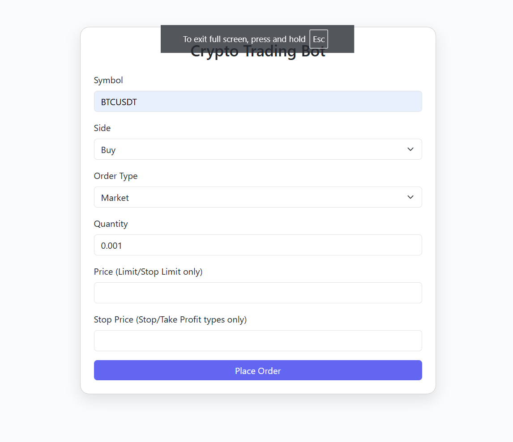
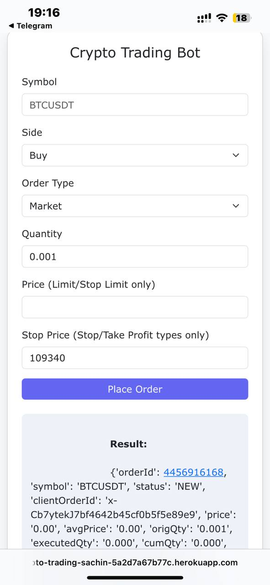

# 🚀 Binance Futures Testnet Trading Bot

A powerful and beginner-friendly crypto trading bot built with **Python**, featuring a mobile-friendly **Flask Web UI**, and full support for **market**, **limit**, **stop-market**, and **stop-limit** order types on **Binance Futures Testnet**.

> 📍 Perfect for learning, testing strategies, and demo trading — safely and legally.

---

## 🌟 Features

- ✅ **Market / Limit / Stop Orders** (Stop-Market, Stop-Limit)
- 📈 **Web UI** for easy order placement (responsive for mobile)
- 💻 **Command-Line Interface (CLI)** for power users
- 📊 Real-time logging and order tracking
- 🔧 Robust input validation and error handling

---

## 🔧 Tech Stack

- Python 3.10+
- Flask
- python-binance SDK
- dotenv + requests + logging
- Bootstrap 5 for UI (or Tailwind, based on version)

---

## 🖼️ Web UI Preview

| Desktop | Mobile |
|--------|--------|
|  |  |

---

## 🚀 Quick Start (Local)

```bash
git clone https://github.com/5c4in/crypto-trading-bot

# Install dependencies
pip install -r requirements.txt

# Add your testnet API keys in .env file
echo -e "API_KEY=your_api_key\nAPI_SECRET=your_api_secret" > .env

# Start web UI (localhost:5000)
python web_ui.py
```

### 🔃 OR start CLI mode:
```bash
python trade.py --symbol BTCUSDT --side BUY --type MARKET --quantity 0.001
```

---